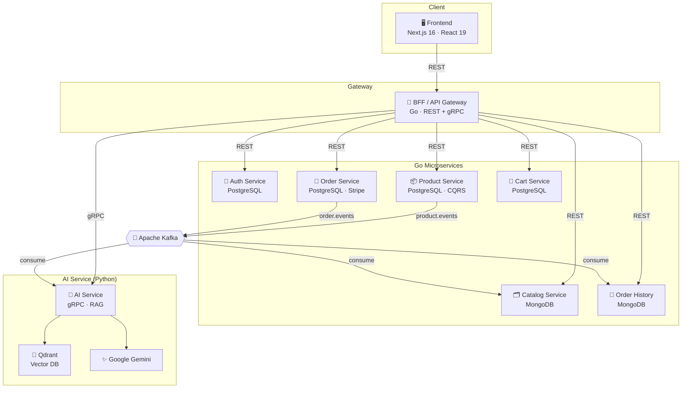
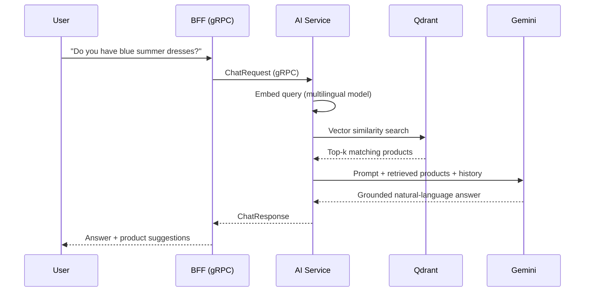

<div align="center">

# 🛍️ Andaman Breeze — Microservices E-Commerce with RAG AI Assistant

**แพลตฟอร์มร้านค้าออนไลน์แบบ Event-Driven Microservices พร้อมผู้ช่วย AI ค้นหาสินค้าด้วยเทคนิค RAG**

*A full-stack, event-driven e-commerce platform built on a polyglot microservices architecture, featuring a multilingual RAG-powered shopping assistant.*

<br />

<!-- Tech badges -->


</div>

---

## 📑 Table of Contents

- [Overview](#-overview)
- [Key Features](#-key-features)
- [Architecture](#-architecture)
- [Tech Stack](#-tech-stack)
- [Services & Ports](#-services--ports)
- [How the RAG Assistant Works](#-how-the-rag-assistant-works)
- [Design Patterns](#-design-patterns)
- [Project Structure](#-project-structure)
- [Getting Started](#-getting-started)
- [Environment Variables](#-environment-variables)
- [Developer Tools](#-developer-tools)
- [License](#-license)

---

## 🌊 Overview

**Andaman Breeze** is a production-style e-commerce system decomposed into independent microservices that communicate through **REST**, **gRPC**, and **asynchronous Kafka events**. Beyond a standard storefront, it ships with an **AI shopping assistant** that answers product questions in natural language (including Thai) by retrieving real catalog data from a vector database and grounding a Large Language Model's response on it — a classic **Retrieval-Augmented Generation (RAG)** pipeline.

The project is a study in real-world distributed-system concerns: eventual consistency, transactional messaging, service isolation by database, and clean, testable architecture.

---

## ✨ Key Features

- **🛒 Full shopping flow** — browse products, cart, checkout, and order history.
- **🤖 RAG AI assistant** — a floating chat that understands questions about your catalog and answers using live product data, powered by Google Gemini + a multilingual embedding model.
- **💳 Stripe payments** — real payment intents with webhook handling and a payment-timeout worker.
- **🔐 Authentication** — JWT sessions plus Google OAuth sign-in, with separate user and admin roles.
- **🗂️ Admin dashboard** — manage products, categories, attributes, orders, and admins.
- **📨 Event-driven sync** — product and order changes propagate across services via Kafka, keeping the catalog, order history, and vector store in sync.
- **🌐 API Gateway (BFF)** — a single entry point that proxies REST to backend services and bridges gRPC to the AI service.

---

## 🏗️ Architecture

The system follows a **Backend-for-Frontend (BFF)** gateway pattern. The frontend talks only to the BFF, which fans out to the appropriate microservice. Services never share a database — each owns its own data store, and cross-service data flows through Kafka events.



**Flow highlights**

- The **Product Service** publishes `product.events` whenever the catalog changes. The **Catalog Service** (read-optimized, MongoDB) and the **AI Service** both consume these events — the AI service re-embeds products and updates Qdrant so the assistant always searches fresh data.
- The **Order Service** uses the **Outbox pattern** to reliably publish `order.events`, which the **Order History Service** consumes to build a queryable history.

---

## 🧰 Tech Stack

| Layer | Technologies |
|---|---|
| **Frontend** | Next.js 16, React 19, TypeScript, Tailwind CSS v4, Stripe.js, Google OAuth, react-markdown |
| **Backend (Go)** | Go 1.25, GORM, gRPC, JWT, Swagger (product service) |
| **AI Service (Python)** | FastAPI, gRPC, LangChain, Google Gemini, Sentence-Transformers, Qdrant client |
| **Databases** | PostgreSQL 17 (auth, product, order, cart), MongoDB 7 (catalog, order history), Qdrant (vectors) |
| **Messaging** | Apache Kafka (KRaft mode, no ZooKeeper) |
| **Infrastructure** | Docker & Docker Compose, pgAdmin, Kafka-UI |

---

## 🔌 Services & Ports

| Service | Tech | Data Store | Port | Protocol |
|---|---|---|---|---|
| Frontend | Next.js | — | `3000` | HTTP |
| BFF / Gateway | Go | — | `8080` | REST + gRPC |
| Auth Service | Go | PostgreSQL | `3001` | REST |
| Product Service | Go | PostgreSQL | `3002` | REST + Kafka |
| Order Service | Go | PostgreSQL | `3003` | REST + Kafka |
| Cart Service | Go | PostgreSQL | `3004` | REST |
| Catalog Service | Go | MongoDB | `3005` | Kafka consumer |
| Order History Service | Go | MongoDB | `3006` | Kafka consumer |
| AI Service | Python | Qdrant | `50051` (gRPC) / `8000` (health) | gRPC + Kafka |
| PostgreSQL | — | — | `5432` | — |
| MongoDB | — | — | `27017` | — |
| Qdrant | — | — | `6333` | — |
| Kafka | — | — | `9094` | — |
| pgAdmin | — | — | `5050` | Web UI |
| Kafka-UI | — | — | `8081` | Web UI |

---

## 🧠 How the RAG Assistant Works

The AI assistant grounds every answer on real catalog data instead of the model's memory, which reduces hallucination and keeps answers accurate to your inventory.



1. **Ingestion** — When products change, `product.events` are consumed and each product is converted into a vector using `sentence-transformers/paraphrase-multilingual-mpnet-base-v2` (768-dim), then stored in **Qdrant**.
2. **Retrieval** — A user's question is embedded with the same model and used to search Qdrant for the most relevant products.
3. **Generation** — The retrieved products, plus recent conversation history, are passed to **Google Gemini**, which produces a grounded, multilingual answer.

---

## 🎯 Design Patterns

This project intentionally applies several architecture and distributed-system patterns:

- **Hexagonal Architecture (Ports & Adapters)** — every service separates its `core` (domain, ports, services) from `adapters` (HTTP, repositories, messaging), making business logic framework-agnostic and testable.
- **CQRS** — read and write paths are split into `command` and `query` services (see product and cart services).
- **Outbox / Inbox Pattern** — reliable, exactly-once-style messaging: events are written to an outbox in the same DB transaction and published by a background worker; consumers dedupe via an inbox.
- **Backend-for-Frontend (BFF)** — a single gateway tailors and aggregates backend calls for the frontend.
- **Database-per-Service** — each service owns its data (PostgreSQL or MongoDB), enforcing loose coupling.

---

## 📂 Project Structure

```
microservice-with-rag/
├── backend/
│   ├── bff/                      # API Gateway (REST proxy + gRPC client to AI)
│   ├── pkg/                      # Shared Go libraries (logs, events, jwt, db, middleware)
│   └── services/
│       ├── auth_service/         # Go · PostgreSQL · JWT + Google OAuth
│       ├── product_service/      # Go · PostgreSQL · CQRS · Outbox · Swagger
│       ├── order_service/        # Go · PostgreSQL · Stripe · Outbox/Inbox
│       ├── cart_service/         # Go · PostgreSQL
│       ├── catalog_service/      # Go · MongoDB · Kafka consumer
│       ├── order_history_service/# Go · MongoDB · Kafka consumer
│       └── ai_service/           # Python · gRPC · RAG (Qdrant + Gemini)
├── frontend/                     # Next.js 16 · React 19 · Tailwind v4
├── docker-entrypoint-initdb.d/   # Multi-database Postgres init script
└── docker-compose.yml            # Full local stack
```

---

## 🚀 Getting Started

### Prerequisites

- [Docker](https://www.docker.com/) & Docker Compose
- [Node.js](https://nodejs.org/) 20+ (to run the frontend locally)
- A **Google Gemini API key** (for the AI assistant)
- A **Stripe** account with test keys (for checkout)

### 1. Clone the repository

```bash
git clone https://github.com/THANN-X/microservice-with-rag.git
cd microservice-with-rag
```

### 2. Configure environment

Create a `.env` file in the project root (see [Environment Variables](#-environment-variables) below).

### 3. Start the backend stack

```bash
docker compose up --build
```

This launches all databases, Kafka, the Go microservices, the AI service, and the developer UIs.

### 4. Run the frontend

```bash
cd frontend
npm install
npm run dev
```

The app will be available at **http://localhost:3000**.

---

## 🔑 Environment Variables

Create a `.env` file in the root. Below are the keys referenced by `docker-compose.yml` — fill in your own values:

```env
# --- PostgreSQL ---
POSTGRES_USER=postgres
POSTGRES_PASSWORD=your_password
POSTGRES_DB_NAMES=auth_db,product_db,order_db,cart_db
APP_DB_USER=your_app_user
APP_DB_PASSWORD=your_app_password

# --- pgAdmin ---
PGADMIN_EMAIL=admin@example.com
PGADMIN_PASSWORD=admin

# --- MongoDB ---
MONGO_USER=admin
MONGO_PASSWORD=password

# --- Auth ---
JWT_SECRET=your_jwt_secret
GOOGLE_CLIENT_ID=your_google_client_id

# --- Payments ---
STRIPE_SECRET_KEY=sk_test_xxx
STRIPE_WEBHOOK_SECRET=whsec_xxx

# --- AI Service ---
GOOGLE_API_KEY=your_gemini_api_key
GEMINI_MODEL=gemini-2.0-flash
```

> ⚠️ **Never commit your `.env`.** It's already excluded via `.gitignore`. Consider adding a `.env.example` with placeholder values so others know which keys are required.

---

## 🛠️ Developer Tools

Once the stack is running, these dashboards are available:

| Tool | URL | Purpose |
|---|---|---|
| **pgAdmin** | http://localhost:5050 | Inspect PostgreSQL databases |
| **Kafka-UI** | http://localhost:8081 | View topics, messages, and consumer groups |
| **Swagger** | via product service | Explore the product API |

---

## 📄 License

This project is currently unlicensed. If you plan to share or open-source it, consider adding a `LICENSE` file (e.g. [MIT](https://choosealicense.com/licenses/mit/)) so others know how they may use it.

---

<div align="center">

Built with ☕ and a lot of `docker compose up` by [**THANN-X**](https://github.com/THANN-X)

⭐ If you find this project useful, consider giving it a star!

</div>
