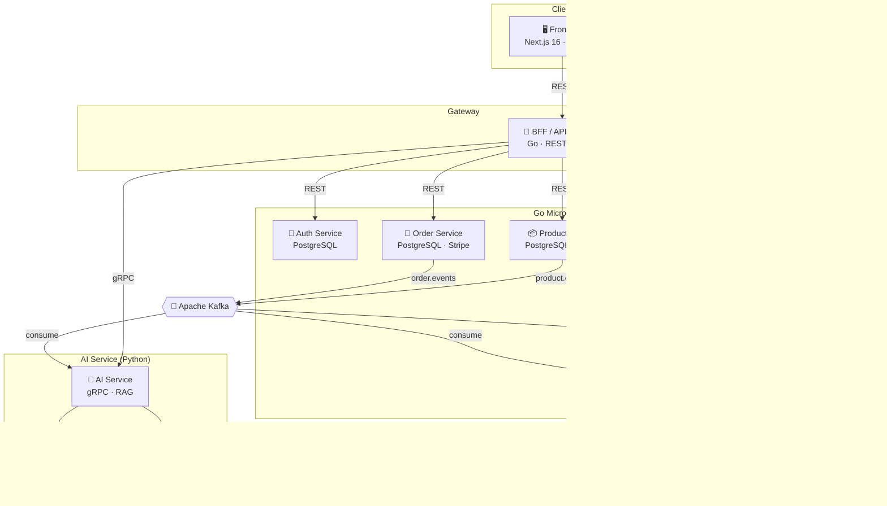
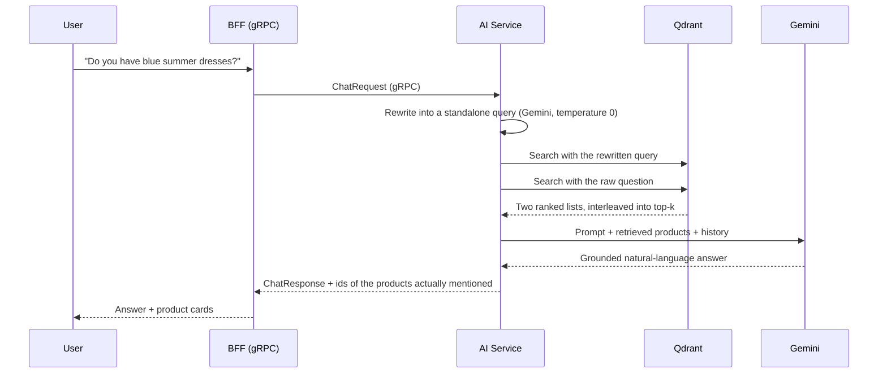
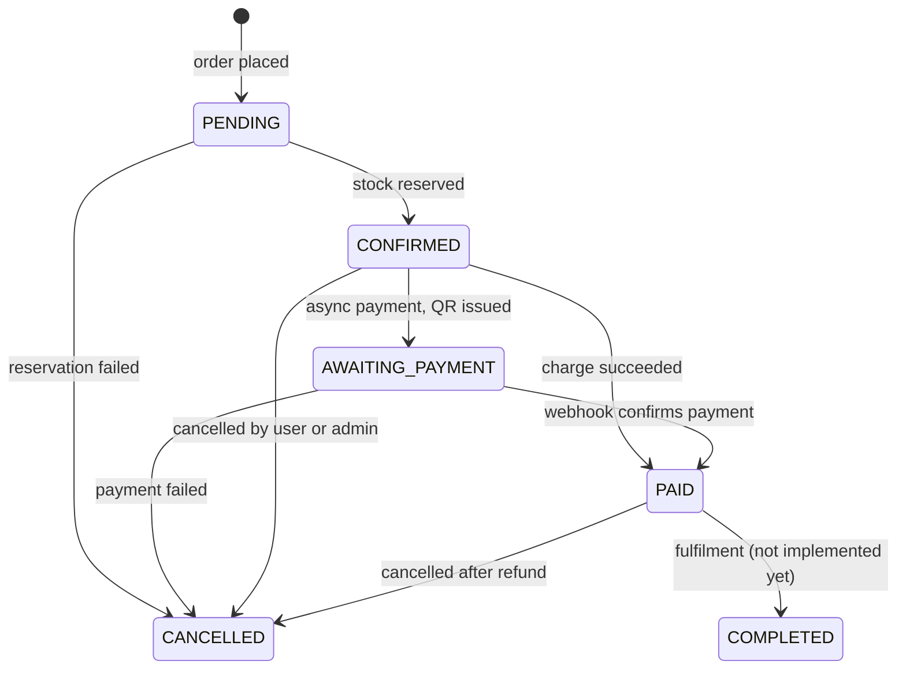

<div align="center">

# 🛍️ Ananta — Microservices E-Commerce with RAG AI Assistant

**แพลตฟอร์มร้านค้าออนไลน์แบบ Event-Driven Microservices พร้อมผู้ช่วย AI ค้นหาสินค้าด้วยเทคนิค RAG**

*A full-stack, event-driven e-commerce platform built on a polyglot microservices architecture, featuring a multilingual RAG-powered shopping assistant.*

<br />

<!-- Tech badges -->


</div>

---

## 📑 Table of Contents

- [Overview](#-overview)
- [Key Features](#-key-features)
- [Architecture](#-architecture)
- [Tech Stack](#-tech-stack)
- [Services & Ports](#-services--ports)
- [How the RAG Assistant Works](#-how-the-rag-assistant-works)
- [Retrieval Evaluation](#-retrieval-evaluation)
- [Order Lifecycle & Events](#-order-lifecycle--events)
- [Design Patterns](#-design-patterns)
- [Project Structure](#-project-structure)
- [Getting Started](#-getting-started)
- [Environment Variables](#-environment-variables)
- [Testing](#-testing)
- [Developer Tools](#-developer-tools)
- [License](#-license)

---

## 🌊 Overview

**Ananta** is a production-style e-commerce system decomposed into independent microservices that communicate through **REST**, **gRPC**, and **asynchronous Kafka events**. Beyond a standard storefront, it ships with an **AI shopping assistant** that answers product questions in natural language (including Thai) by retrieving real catalog data from a vector database and grounding a Large Language Model's response on it — a classic **Retrieval-Augmented Generation (RAG)** pipeline.

The project is a study in real-world distributed-system concerns: eventual consistency, transactional messaging, service isolation by database, and clean, testable architecture.

---

## ✨ Key Features

- **🛒 Full shopping flow** — browse products, cart, checkout, and order history.
- **🤖 RAG AI assistant** — a floating chat that understands questions about your catalog and answers using live product data, powered by Google Gemini and the `BAAI/bge-m3` multilingual retrieval model. Retrieval quality is [measured, not assumed](#-retrieval-evaluation).
- **💳 Stripe payments** — real payment intents with webhook handling and a payment-timeout worker.
- **🔐 Authentication** — JWT sessions plus Google OAuth sign-in, with separate user and admin roles.
- **🗂️ Admin dashboard** — manage products, categories, attributes, orders, and admins.
- **📨 Event-driven sync** — product and order changes propagate across services via Kafka, keeping the catalog, order history, and vector store in sync.
- **🌐 API Gateway (BFF)** — a single entry point that proxies REST to backend services and bridges gRPC to the AI service.

---

## 🏗️ Architecture

The system follows a **Backend-for-Frontend (BFF)** gateway pattern. The frontend talks only to the BFF, which fans out to the appropriate microservice. Services never share a database — each owns its own data store, and cross-service data flows through Kafka events.


```mermaid
flowchart TB
    subgraph Client
        FE["🖥️ Frontend<br/>Next.js 16 · React 19"]
    end

    subgraph Gateway
        BFF["🚪 BFF / API Gateway<br/>Go · REST + gRPC"]
    end

    subgraph "Go Microservices"
        AUTH["🔐 Auth Service<br/>PostgreSQL"]
        PROD["📦 Product Service<br/>PostgreSQL · CQRS"]
        ORDER["🧾 Order Service<br/>PostgreSQL · Stripe"]
        CART["🛒 Cart Service<br/>PostgreSQL"]
        CAT["🗂️ Catalog Service<br/>MongoDB"]
        HIST["📜 Order History<br/>MongoDB"]
    end

    subgraph "AI Service (Python)"
        AI["🤖 AI Service<br/>gRPC · RAG"]
        QD["🧠 Qdrant<br/>Vector DB"]
        LLM["✨ Google Gemini"]
    end

    KAFKA{{"📨 Apache Kafka"}}

    FE -->|REST| BFF
    BFF -->|REST| AUTH & PROD & ORDER & CART & CAT & HIST
    BFF -->|gRPC| AI

    PROD -->|product.events| KAFKA
    ORDER -->|order.events| KAFKA
    KAFKA -->|consume| CAT & HIST & AI

    AI --> QD
    AI --> LLM
```

**Flow highlights**

- The **Product Service** publishes `product.events` whenever the catalog changes. The **Catalog Service** (read-optimized, MongoDB) and the **AI Service** both consume these events — the AI service re-embeds products and updates Qdrant so the assistant always searches fresh data.
- The **Order Service** uses the **Outbox pattern** to reliably publish `order.events`, which the **Order History Service** consumes to build a queryable history.

---

## 🧰 Tech Stack

| Layer | Technologies |
|---|---|
| **Frontend** | Next.js 16, React 19, TypeScript, Tailwind CSS v4, Stripe.js, Google OAuth, react-markdown |
| **Backend (Go)** | Go 1.25, GORM, gRPC, JWT, Swagger (product service) |
| **AI Service (Python)** | FastAPI, gRPC, LangChain, Google Gemini, Sentence-Transformers (`BAAI/bge-m3`), Qdrant client |
| **Databases** | PostgreSQL 17 (auth, product, order, cart), MongoDB 7 (catalog, order history), Qdrant (vectors) |
| **Messaging** | Apache Kafka (KRaft mode, no ZooKeeper) |
| **Infrastructure** | Docker & Docker Compose, pgAdmin, Kafka-UI |

---

## 🔌 Services & Ports

| Service | Tech | Data Store | Port | Protocol |
|---|---|---|---|---|
| Frontend | Next.js | — | `3000` | HTTP |
| BFF / Gateway | Go | — | `8080` | REST + gRPC |
| Auth Service | Go | PostgreSQL | `3001` | REST |
| Product Service | Go | PostgreSQL | `3002` | REST + Kafka |
| Order Service | Go | PostgreSQL | `3003` | REST + Kafka |
| Cart Service | Go | PostgreSQL | `3004` | REST |
| Catalog Service | Go | MongoDB | `3005` | Kafka consumer |
| Order History Service | Go | MongoDB | `3006` | Kafka consumer |
| AI Service | Python | Qdrant | `50051` (gRPC) / `8000` (health) | gRPC + Kafka |
| PostgreSQL | — | — | `5432` | — |
| MongoDB | — | — | `27017` | — |
| Qdrant | — | — | `6333` | — |
| Kafka | — | — | `9094` | — |
| pgAdmin | — | — | `5050` | Web UI |
| Kafka-UI | — | — | `8081` | Web UI |

---

## 🧠 How the RAG Assistant Works

The AI assistant grounds every answer on real catalog data instead of the model's memory, which reduces hallucination and keeps answers accurate to your inventory.


```mermaid
sequenceDiagram
    participant U as User
    participant BFF as BFF (gRPC)
    participant AI as AI Service
    participant Q as Qdrant
    participant G as Gemini

    U->>BFF: "Do you have blue summer dresses?"
    BFF->>AI: ChatRequest (gRPC)
    AI->>AI: Rewrite into a standalone query (Gemini, temperature 0)
    AI->>Q: Search with the rewritten query
    AI->>Q: Search with the raw question
    Q-->>AI: Two ranked lists, interleaved into top-k
    AI->>G: Prompt + retrieved products + history
    G-->>AI: Grounded natural-language answer
    AI-->>BFF: ChatResponse + ids of the products actually mentioned
    BFF-->>U: Answer + product cards
```

1. **Ingestion** — When products change, `product.events` are consumed and each product is embedded with **`BAAI/bge-m3`** (1024-dim) into the `products_bge_m3` collection in **Qdrant**.
2. **Contextualisation** — a follow-up like *"does it come in another colour?"* means nothing on its own, so a separate Gemini call rewrites it into a standalone query. That call runs at **temperature 0** — sharing the answering model's 0.7 made the same question produce a different query on every attempt — and sees only the last three turns, because older answers are long and full of product names that drag the rewrite back to the previous category. The prompt is instructed to drop every earlier constraint when the user changes subject.
3. **Retrieval** — both the rewritten query **and** the user's raw question are searched, and the two ranked lists are interleaved rather than merged by score. A contaminated rewrite tends to score *higher* (more words, closer to the previous category), so sorting by score alone would push out what the user actually asked for. Cost is one extra embedding, computed locally.
4. **Generation** — the retrieved products and the full conversation history go to **Google Gemini**, which answers grounded in that context only.
5. **Product cards** — the reply is scanned for which products were actually mentioned, matching on every word of a product name after stripping markdown, because the model routinely rewords names and wraps them in bold. Only those ids are returned to the frontend.

`RAG_TOP_K` and `RAG_SCORE_THRESHOLD` are environment variables, so retrieval can be re-tuned without rebuilding the image. See [Retrieval Evaluation](#-retrieval-evaluation) for how the current values were chosen.

> ⚠️ **Changing `EMBEDDING_MODEL` is not a one-line change.** Cosine scores are not comparable across models — `multilingual-e5-base` peaks at a threshold of 0.80 where BGE-M3 peaks at 0.45 — and a collection indexed by one model cannot be searched by another. Changing the model means a new `QDRANT_COLLECTION`, a matching `EMBEDDING_DIM`, a re-index, and a fresh threshold sweep.

---

## 📊 Retrieval Evaluation

Retrieval is the part of a RAG system that quietly decides answer quality, and `top_k` / `score_threshold` started life as magic numbers hardcoded in the first commit. They are now backed by a measurement.

### How it was measured

A **golden set of 34 Thai questions** was written against a 100-product, 6-category catalog, split into two groups that test opposite failure modes:

| Group | Example | What it catches |
|---|---|---|
| **positive** | *"noise-cancelling headphones"* | a threshold set so high it drops products that should be found |
| **negative** | *"book me a flight to Japan"* | a threshold set so low it drags irrelevant products into the prompt |

The negative group matters more than it looks. With positives alone the optimum is always `threshold = 0`, because looser always means higher recall; only negatives reveal where the useful ceiling is. Some are **hard negatives** -- *"I want to buy a house"* collides with the *Home & Kitchen* category -- and those separate good thresholds from bad ones better than anything else.

Every threshold x top_k pair was swept and scored on `hit` (recall@k), `precision@k`, `MRR`, `reject` (share of negatives correctly answered with nothing), and `F1` over hit and reject.

### Model A/B, same golden set, same 100 products

| Model | Best point | hit | prec | MRR | reject | F1 | empty results |
|---|---|---|---|---|---|---|---|
| `paraphrase-multilingual-mpnet-base-v2` *(previous)* | thr 0.45 / k 10 | 0.89 | 0.73 | 0.86 | 1.00 | 0.94 | 3 |
| `multilingual-e5-base` | thr 0.80 / k 5 | 0.96 | 0.84 | 0.94 | 1.00 | 0.98 | 1 |
| **`BAAI/bge-m3`** *(in use)* | **thr 0.45 / k 5** | **1.00** | **0.89** | **0.98** | **1.00** | **1.00** | **0** |

**BGE-M3 misses nothing across all 34 questions** -- it finds every product it should and rejects every out-of-catalog question, including the hard negatives the previous model fell for.

The interesting part is *why* the old model lost. Its ranking was usually right; its absolute scores were not. For *"looking for a laptop for video editing"* the correct products sat at ranks 1-3 with scores around 0.33, while a query using the exact catalog wording scored 0.506 -- classic behaviour for a **symmetric paraphrase** model asked to do **asymmetric retrieval** (short question against long document). No amount of threshold tuning fixes that; a retrieval-trained model does.

Two further results shaped the configuration:

- **`top_k` dropped from 15 to 5.** With BGE-M3 at threshold 0.45, `hit` and `MRR` are identical from k=5 through k=15 while `precision` falls from 0.89 to 0.79. Larger k spends tokens for nothing.
- **Thresholds do not transfer between models.** e5-base peaks at 0.80, BGE-M3 at 0.45, on identical data. Carrying a threshold across a model change silently breaks retrieval.

### What this number does not prove

> `F1 = 1.00` says as much about the test as about the model. 34 self-written questions over 100 products in six cleanly separated categories is an **easy** golden set, and the questions were written by reading the seed catalog rather than taken from real user logs. It measures "does the system behave as designed", not "does it serve real users". The honest next steps are harder questions (cross-category, misspelled, spec-level) and questions from real traffic.
>
> Only **retrieval** is measured here. Final answer quality -- faithfulness, answer relevancy -- needs an LLM-as-judge setup (RAGAS, DeepEval) and has not been done.

The sweep harness and golden set are kept out of the repository: they are per-experiment scratch that changes with every run, and the conclusions that matter are recorded in the comments in `ai_service/app/config.py`, next to the values themselves.

### When to re-run it

Score scales shift completely under any of these, and the old values stop being valid:

- changing `EMBEDDING_MODEL`
- changing `ProductDocument.to_embedding_text()` (the text that gets embedded)
- changing the collection's distance metric
- adding a large batch of products or categories

---

## 🧾 Order Lifecycle & Events

An order's state lives in the **Order Service** (PostgreSQL), while nearly everything the customer and admin look at is served from the **Order History Service** (MongoDB), a read model built purely from Kafka events.


```mermaid
stateDiagram-v2
    [*] --> PENDING: order placed
    PENDING --> CONFIRMED: stock reserved
    PENDING --> CANCELLED: reservation failed
    CONFIRMED --> AWAITING_PAYMENT: async payment, QR issued
    CONFIRMED --> PAID: charge succeeded
    AWAITING_PAYMENT --> PAID: webhook confirms payment
    AWAITING_PAYMENT --> CANCELLED: payment failed
    CONFIRMED --> CANCELLED: cancelled by user or admin
    PAID --> CANCELLED: cancelled after refund
    PAID --> COMPLETED: fulfilment (not implemented yet)
```

| Status | Meaning |
|---|---|
| `PENDING` | placed, waiting for the stock reservation result |
| `CONFIRMED` | stock reserved successfully |
| `AWAITING_PAYMENT` | async payment in flight (PromptPay QR issued, result unknown) |
| `PAID` | payment succeeded |
| `CANCELLED` | terminal; no transition out |
| `COMPLETED` | terminal; reserved for a fulfilment flow that does not exist yet |

Events on the `order.events` topic:

| Event | Raised when | Consumed by |
|---|---|---|
| `ORDER_CREATED` | order placed | product service (reserve stock), order history |
| `ORDER_CONFIRMED` | stock reserved | order history |
| `ORDER_AWAITING_PAYMENT` | QR issued, awaiting payment | order history |
| `ORDER_PAID` | payment confirmed | order history |
| `ORDER_RESERVATION_FAILED` | stock insufficient, order cancelled | order history |
| `ORDER_CANCELLED` | cancelled after stock was reserved | product service (**releases stock**), order history |

Two rules are worth knowing before adding an event:

**A state transition that raises no event is a silent bug.** The read model never queries the order service after the fact, so a transition that changes status without publishing leaves it permanently stale -- customers see "awaiting processing" for a dead order, admins see "confirmed" for one that is paid. Nothing crashes, nothing logs, and no replay repairs it, because the event was never published in the first place. `order_status_events_test.go` exists to pin this down.

**`ORDER_CANCELLED` is a command, not a notification.** Product service consumes it and increases stock immediately. An order cancelled because stock was *insufficient* never took stock, so reusing that event would inflate inventory -- hence the separate `ORDER_RESERVATION_FAILED`, which deliberately carries no item list so it cannot be wired up to release stock by accident.

Consumers deduplicate on the `EventID` header (the outbox row's UUID), never on the Kafka offset: offsets restart from zero when a topic or cluster is recreated, which would make a *new* event look like one already processed and drop it silently.

---

## 🎯 Design Patterns

This project intentionally applies several architecture and distributed-system patterns:

- **Hexagonal Architecture (Ports & Adapters)** — every service separates its `core` (domain, ports, services) from `adapters` (HTTP, repositories, messaging), making business logic framework-agnostic and testable.
- **CQRS** — read and write paths are split into `command` and `query` services (see product and cart services).
- **Outbox / Inbox Pattern** — reliable, exactly-once-style messaging: events are written to an outbox in the same DB transaction and published by a background worker; consumers dedupe via an inbox keyed on the producer's `EventID` header, which stays unique across topic recreation and replays.
- **Backend-for-Frontend (BFF)** — a single gateway tailors and aggregates backend calls for the frontend.
- **Database-per-Service** — each service owns its data (PostgreSQL or MongoDB), enforcing loose coupling.

---

## 📂 Project Structure

```
microservice-with-rag/
├── backend/
│   ├── bff/                      # API Gateway (REST proxy + gRPC client to AI)
│   ├── pkg/                      # Shared Go libraries (logs, events, jwt, db, middleware)
│   └── services/
│       ├── auth_service/         # Go · PostgreSQL · JWT + Google OAuth
│       ├── product_service/      # Go · PostgreSQL · CQRS · Outbox · Swagger
│       ├── order_service/        # Go · PostgreSQL · Stripe · Outbox/Inbox
│       ├── cart_service/         # Go · PostgreSQL
│       ├── catalog_service/      # Go · MongoDB · Kafka consumer
│       ├── order_history_service/# Go · MongoDB · Kafka consumer
│       └── ai_service/           # Python · gRPC · RAG (Qdrant + Gemini)
├── frontend/                     # Next.js 16 · React 19 · Tailwind v4
├── docker-entrypoint-initdb.d/   # Multi-database Postgres init script
└── docker-compose.yml            # Full local stack
```

---

## 🚀 Getting Started

### Prerequisites

- [Docker](https://www.docker.com/) & Docker Compose
- [Node.js](https://nodejs.org/) 20+ (to run the frontend locally)
- A **Google Gemini API key** (for the AI assistant)
- A **Stripe** account with test keys (for checkout)

### 1. Clone the repository

```bash
git clone https://github.com/THANN-X/microservice-with-rag.git
cd microservice-with-rag
```

### 2. Configure environment

Create a `.env` file in the project root (see [Environment Variables](#-environment-variables) below).

### 3. Start the backend stack

```bash
docker compose up --build
```

This launches all databases, Kafka, the Go microservices, the AI service, and the developer UIs.

### 4. Run the frontend

```bash
cd frontend
npm install
npm run dev
```

The app will be available at **http://localhost:3000**.

A `frontend/Dockerfile` (Node 22, dev server) is included as well -- uncomment the `frontend-app` block in `docker-compose.yml` to run the whole stack, frontend included, with a single `docker compose up`.

### 5. Stripe webhooks in local development

Payment confirmation arrives by webhook, not by the checkout response, so an order stays at `AWAITING_PAYMENT` until Stripe calls back. Forward events to the gateway with the Stripe CLI:

```bash
stripe listen --forward-to localhost:8080/webhook/payment
```

Put the signing secret it prints into `STRIPE_WEBHOOK_SECRET`. Two things about this endpoint are deliberate: it is exempt from gateway auth (Stripe has no session, the HMAC signature is the authentication), and it answers **200 to event types it does not handle**. Returning an error for those would make Stripe retry with exponential backoff for days and eventually disable the endpoint.

---

## 🔑 Environment Variables

Create a `.env` file in the root. Below are the keys referenced by `docker-compose.yml` — fill in your own values:

```env
# --- PostgreSQL ---
POSTGRES_USER=postgres
POSTGRES_PASSWORD=your_password
POSTGRES_DB_NAMES=auth_db,product_db,order_db,cart_db
APP_DB_USER=your_app_user
APP_DB_PASSWORD=your_app_password

# --- pgAdmin ---
PGADMIN_EMAIL=admin@example.com
PGADMIN_PASSWORD=admin

# --- MongoDB ---
MONGO_USER=admin
MONGO_PASSWORD=password

# --- Auth ---
JWT_SECRET=your_jwt_secret
GOOGLE_CLIENT_ID=your_google_client_id
# sent as the X-Admin-Secret header on POST /api/auth/admin/register
ADMIN_SECRET_KEY=your_admin_secret_key

# --- Payments ---
STRIPE_SECRET_KEY=sk_test_xxx
STRIPE_WEBHOOK_SECRET=whsec_xxx

# --- AI Service ---
GOOGLE_API_KEY=your_gemini_api_key
GEMINI_MODEL=gemini-3.1-flash-lite

# --- AI Service: embeddings and retrieval (optional, defaults shown) ---
# these three must always agree: model, its dimension, and a collection indexed with it
EMBEDDING_MODEL=BAAI/bge-m3
EMBEDDING_DIM=1024
QDRANT_COLLECTION=products_bge_m3
# tunable without rebuilding the image -- see Retrieval Evaluation for how these were chosen
RAG_TOP_K=5
RAG_SCORE_THRESHOLD=0.45
```

`.env.example` in the project root lists every key with placeholder values -- copy it to `.env` to get started.

> ⚠️ **Never commit your `.env`.** It is already excluded via `.gitignore`.

> ⚠️ **The root `.env` wins over everything else.** The same AI settings exist in three places and the precedence is not the obvious one:
>
> | Location | When it applies |
> |---|---|
> | **root `.env`** | substituted into `${VAR}` by Compose -- **overrides everything when running via `docker compose`** |
> | `docker-compose.yml` | its `${VAR:-default}` fallbacks apply only when the root `.env` does not set that key |
> | `app/config.py` | code defaults, used only when the service runs outside Compose |
> | `ai_service/.env` | read only when running the service directly, never by Compose |
>
> Editing `config.py` while the root `.env` still pins the old model leaves the service running the old model with no error anywhere. Verify what actually took effect:
>
> ```bash
> docker exec ai-service-app printenv | grep -E 'EMBEDDING|QDRANT_COLLECTION|RAG_'
> ```

---

## 🧪 Testing

Each Go service is its own module, so tests run per module:

```bash
cd backend/services/order_service && go test ./...
cd backend/services/cart_service  && go test ./...
```

Current coverage is thin and deliberate rather than broad: the Stripe gateway adapter, the cart command and query services, and the order domain's state transitions. That last one guards a failure that is invisible at runtime -- a transition that changes status without publishing an event breaks nothing until someone notices a stale order page days later.

Frontend type checking:

```bash
cd frontend && npx tsc --noEmit
```

---

## 🛠️ Developer Tools

Once the stack is running, these dashboards are available:

| Tool | URL | Purpose |
|---|---|---|
| **pgAdmin** | http://localhost:5050 | Inspect PostgreSQL databases |
| **Kafka-UI** | http://localhost:8081 | View topics, messages, and consumer groups |
| **Swagger** | via product service | Explore the product API |

### Command-line tools

```bash
cd backend/services/order_service
go run ./cmd/backfill                # dry run: report what would be published
go run ./cmd/backfill -apply         # write the events to the outbox
go run ./cmd/backfill -resync-paid   # also re-emit ORDER_PAID for paid orders
```

`cmd/backfill` repairs order-history documents left stale by transitions that used to change status without publishing an event. It writes into the outbox rather than touching MongoDB directly, so the events travel the normal pipeline and leave an audit trail. It only ever emits event types the product service does not consume, so it cannot trigger a stock release.

---

## 📄 License

This project is licensed under the MIT License — see the [LICENSE](LICENSE) file for details.

---

<div align="center">

Built with ☕ and a lot of `docker compose up` by [**THANN-X**](https://github.com/THANN-X)

⭐ If you find this project useful, consider giving it a star!

</div>
